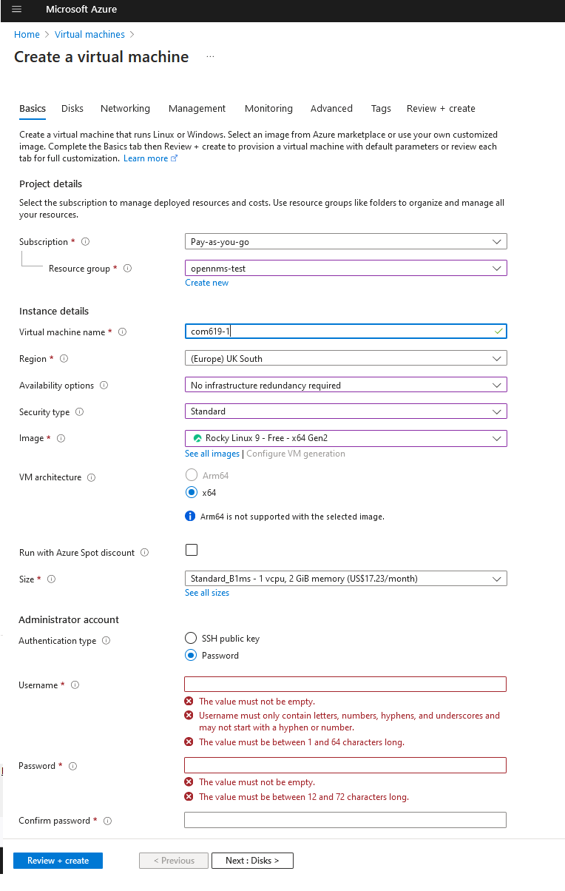
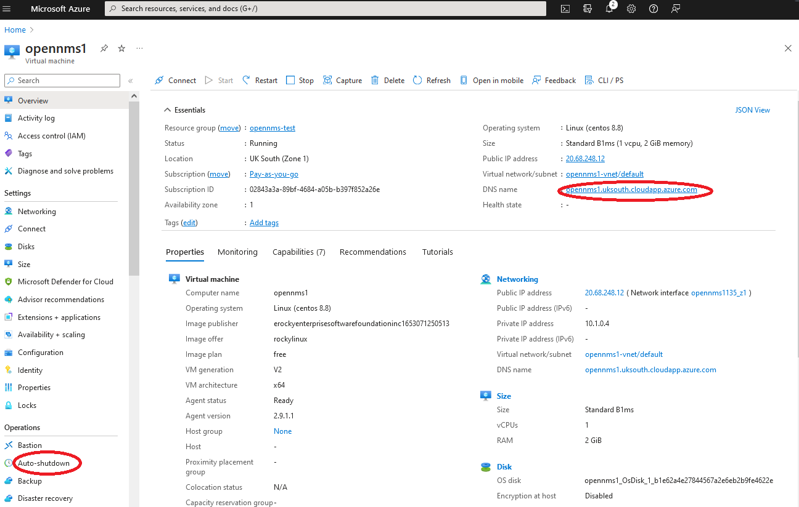
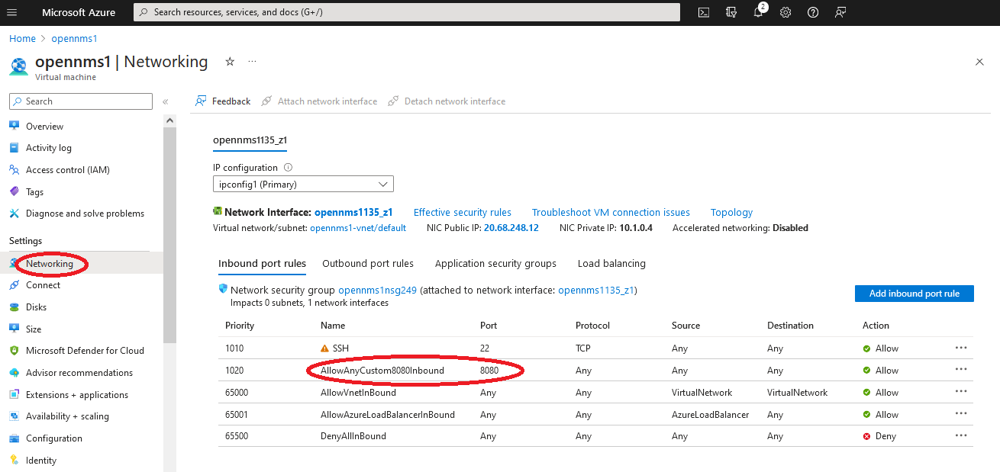

# Setting up a develop server in Azure

The simplest way to set up a hosted application in Azure is to set up a small virtual machine with an interface exposed to the internet. More complex containerised applications can be deployed if the server has docker and docker-compose installed. 

These are the steps I have taken to set up a simple server reachable at opennms1.uksouth.cloudapp.azure.com

The actual application can be seen at [http://opennms1.uksouth.cloudapp.azure.com:8080](http://opennms1.uksouth.cloudapp.azure.com:8080)

## Get an Azure account

Register for a free student Azure account using your solent email address at https://azure.microsoft.com/en-gb/free/students

## Create a small virtual machine
I used the following specs to install a Rocky Linux machine.
To keep costs down when you create a virtual machine

a) use the smallest machine size you can find (currently Standard B1ms (1 vcpu, 2 GiB memory)

b) use HDD not SSD disk. 

c) select no availability groups

d) set a strong password or better use SSH keys

## Configure your machine once created

a) IMPORTANT set up auto shutdown to limit the usage of your machine
b) set a DNS name for your machine. This will be stable even if the public IP address changes

## set up the firewall

a) the azure firewall should already allow SSH on port 22

b) add a new rule for port 8080

