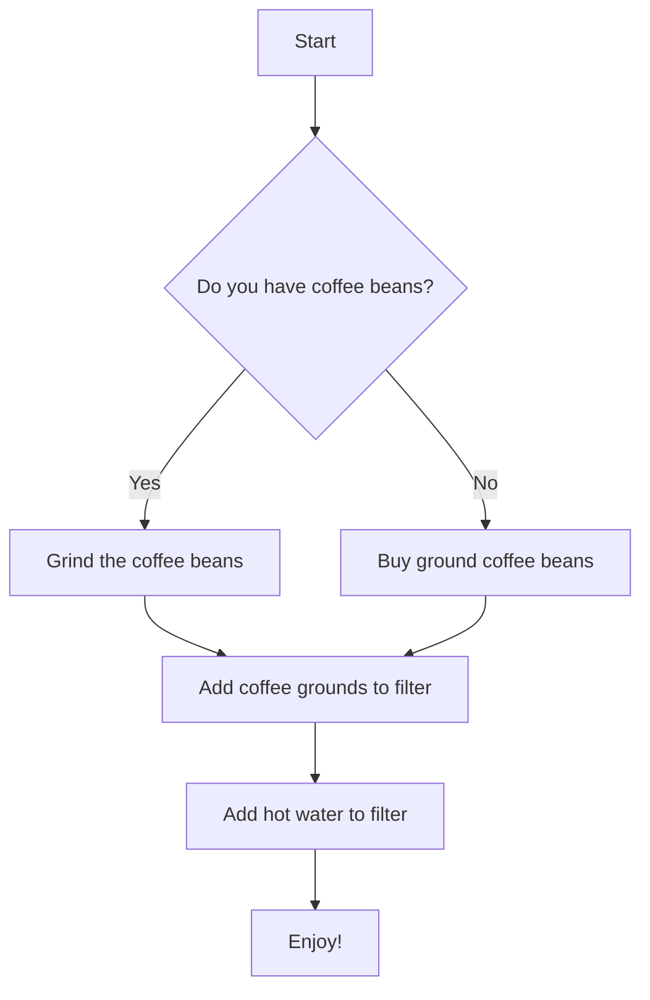

```mermaid
graph TD

subgraph Sprint Planning
    Start --> "Sprint Planning"
    "Sprint Planning" --> "Sprint Backlog"
end

subgraph Sprint
    "Sprint Backlog" --> "Daily Scrum"
    "Daily Scrum" --> "Development"
    "Development" --> "Testing"
    "Testing" --> "Sprint Review"
end

subgraph Sprint Closure
    "Sprint Review" --> "Sprint Retrospective"
    "Sprint Retrospective" --> End
end
```
